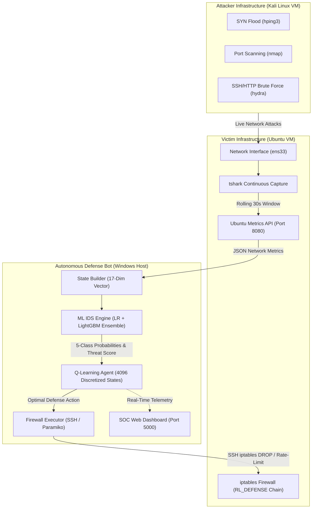

# Self-Healing Network Defense Bot with Reinforcement Learning

[](https://www.python.org/)
[](https://gymnasium.farama.org/)
[](https://scikit-learn.org/)
[](https://www.vmware.com/)
[](LICENSE)

An **autonomous, self-healing network defense agent** that combines **Machine Learning Intrusion Detection (IDS)** with **Reinforcement Learning (Q-Learning)** to automatically detect, analyze, and mitigate cyber attacks on enterprise network infrastructure in real-time.

The system features dual execution modes: a **Live VMware Environment** (attacking Kali Linux VM vs defending Ubuntu VM with active `iptables` mitigation over SSH) and a **VM-Free Simulation Mode** powered by real CIC-IDS2017 dataset sampling.

---

## Key Features

- **Autonomous RL Agent**: Model-free Q-Learning agent with $\epsilon$-greedy exploration that learns optimal defense strategies (Allow, Block IP, Rate-Limit, Soft Restart, Flush Rules) without manual human intervention.
- **100% ML-Driven Reward System**: Dynamic reward math computed directly from 5-class ensemble prediction probabilities ($P_{\text{benign}}, P_{\text{bot}}, P_{\text{ddos}}, P_{\text{scan}}, P_{\text{brute}}$)—eliminating hardcoded rule thresholds or static alert counts.
- **Dual-Model Ensemble Intrusion Detection Engine**:
  - **52 → 30 Feature Selection** via `SelectKBest` and `StandardScaler`.
  - **Logistic Regression (Primary 80%)** + **LightGBM (Secondary 20%)** ensemble trained on the CIC-IDS2017 benchmark dataset.
- **Real-Time SOC Web Dashboard**:
  - Live HTTP + WebSockets (Flask-SocketIO) dashboard monitoring threat scores, CPU/Memory telemetry, active firewall rules, probability distributions, and RL reward convergence curves.
- **Dual Execution Modes**:
  - **Live Mode**: Fully automated VMware orchestration via `vmrun.exe`. Auto-boots Kali & Ubuntu VMs, deploys `tshark` continuous network feature extractors, and executes live attack scripts (`nmap`, `hping3`, `hydra`).
  - **Simulation Mode**: Instant VM-free local training using real CIC-IDS2017 dataset sample caching and fallback synthetic traffic generators.
- **Resilience & Whitelisting**: Automated infrastructure whitelisting (Gateway, Loopback, DNS) to prevent self-lockout during heavy DDoS mitigation.

---

## System Architecture



---

## Machine Learning & Reinforcement Learning Mechanics

### 1. Intrusion Detection System (IDS Engine)

The intrusion detection pipeline ingests 52 network telemetry features (Flow Duration, Packets/s, IAT Mean/Std, Window Sizes, Flag Counts, etc.) matching the **CIC-IDS2017** benchmark schema:

$$\mathbf{x}_{\text{raw}} \in \mathbb{R}^{52} \xrightarrow{\text{SelectKBest}} \mathbf{x}_{\text{sel}} \in \mathbb{R}^{30} \xrightarrow{\text{StandardScaler}} \mathbf{x}_{\text{scaled}} \in \mathbb{R}^{30}$$

The feature vector is evaluated by an ensemble classifier:
- **Logistic Regression (Primary)**: 95.6% benchmark test accuracy. Handles linear decision boundaries cleanly.
- **LightGBM (Secondary)**: Gradient boosted tree validation for high-confidence model agreement.

The output maps 7 IDS attack labels (`Normal Traffic`, `Bots`, `Brute Force`, `DDoS`, `DoS`, `Port Scanning`, `Web Attacks`) into **5 RL Traffic Families**: `BENIGN`, `Bot`, `DDoS`, `PortScan`, `Brute`.

---

### 2. Reinforcement Learning Environment (`NetworkDefenseEnv`)

#### **Observation Space ($\mathbb{R}^{17}$)**
The agent perceives the environment through a 17-dimensional continuous observation vector:

| Index | Feature Name | Description | Range |
| :---: | :--- | :--- | :---: |
| `0` | `p_benign` | ML Probability of Benign Traffic | $[0.0, 1.0]$ |
| `1` | `p_bot` | ML Probability of Botnet Activity | $[0.0, 1.0]$ |
| `2` | `p_ddos` | ML Probability of DDoS / DoS Attack | $[0.0, 1.0]$ |
| `3` | `p_scan` | ML Probability of Port Scanning | $[0.0, 1.0]$ |
| `4` | `p_brute` | ML Probability of Brute Force Attack | $[0.0, 1.0]$ |
| `5` | `threat_score` | Ensemble Threat Intensity Score | $[0.0, 1.0]$ |
| `6` | `confidence` | Ensemble Maximum Class Confidence | $[0.0, 1.0]$ |
| `7` | `class_idx` | Normalized Predicted Class Index | $[0.0, 1.0]$ |
| `8` | `models_agree` | Model Agreement Bit (1.0 if LR == LGB) | $\{0.0, 1.0\}$ |
| `9` | `cpu_percent` | Victim Ubuntu CPU Load Percentage | $[0.0, 1.0]$ |
| `10` | `mem_percent` | Victim Ubuntu Memory Usage Percentage | $[0.0, 1.0]$ |
| `11` | `bytes_recv` | Inbound Traffic Volume (Normalized) | $[0.0, 1.0]$ |
| `12` | `bytes_sent` | Outbound Traffic Volume (Normalized) | $[0.0, 1.0]$ |
| `13–16` | `one_hot_*` | One-Hot Encoding (`BENIGN`, `Bot`, `DDoS`, `PortScan`) | $\{0.0, 1.0\}$ |

---

#### **Action Space (5 Discrete Actions)**

| ID | Action Name | Mechanism | Operational Use Case |
| :---: | :--- | :--- | :--- |
| `0` | **Allow** | Do Nothing / Pass Traffic | Normal legitimate traffic |
| `1` | **Block IP** | `iptables -I RL_DEFENSE 1 -s <IP> -j DROP` | Targeted scans, brute force, single-source bots |
| `2` | **Rate-Limit** | `iptables -I RL_DEFENSE 1 -s <Subnet> -j DROP` | Subnet-wide DDoS / volumetric flood mitigation |
| `3` | **Restart Service** | `iptables -F RL_DEFENSE` (Soft Reset) | System recovery under state table exhaustion |
| `4` | **Flush Rules** | Clear all active firewall blocks | Reset state when attack ceases |

---

#### **100% ML-Driven Reward Function**

The reward function relies strictly on the ensemble probability vector $\mathbf{P} = [P_{\text{safe}}, P_{\text{bot}}, P_{\text{ddos}}, P_{\text{scan}}, P_{\text{brute}}]$, penalizing false positives (blocking legitimate users) and false negatives (allowing attacks):

$$\text{Reward}(a) = \begin{cases}
P_{\text{safe}} \cdot 1.0 - P_{\text{attack}} \cdot 5.0 & \text{if } a = \text{Allow } (0) \\
(P_{\text{scan}} + P_{\text{bot}} + P_{\text{brute}}) \cdot 5.0 + P_{\text{ddos}} \cdot 2.0 - P_{\text{safe}} \cdot 3.0 & \text{if } a = \text{Block IP } (1) \\
P_{\text{ddos}} \cdot 6.0 + (P_{\text{bot}} + P_{\text{brute}}) \cdot 2.0 + P_{\text{scan}} \cdot 1.0 - P_{\text{safe}} \cdot 3.0 & \text{if } a = \text{Rate-Limit } (2) \\
(P_{\text{bot}} + P_{\text{ddos}} + P_{\text{brute}}) \cdot 4.0 - P_{\text{safe}} \cdot 2.0 - P_{\text{scan}} \cdot 1.0 & \text{if } a = \text{Restart } (3) \\
P_{\text{attack}} \cdot 3.0 - P_{\text{safe}} \cdot 4.0 & \text{if } a = \text{Flush } (4)
\end{cases}$$

---

#### **Q-Table State Discretization**

To maintain ultra-fast $\mathcal{O}(1)$ updates without deep learning overhead, the Q-table discretizes 6 core dimensions ($P_{\text{benign}}, P_{\text{ddos}}, P_{\text{scan}}, \text{threat\_score}, \text{confidence}, \text{models\_agree}$) into 4 discrete bins:

$$\text{State Space Size} = 4^6 = 4,096 \text{ states} \quad \times \quad 5 \text{ actions} = 20,480 \text{ Q-values max}$$

$$Q(s, a) \leftarrow Q(s, a) + \alpha \left[ r + \gamma \max_{a'} Q(s', a') - Q(s, a) \right]$$

- **Learning Rate ($\alpha$)**: `0.3` (fast convergence)
- **Discount Factor ($\gamma$)**: `0.90`
- **Exploration ($\epsilon$)**: Decays from `1.0` to `0.05` at rate `0.92` per episode.

---

## Performance & Evaluation

```
============================================================
  RL Network Defense Bot — Evaluation Summary
============================================================
  Agent      : Q-Table (Epsilon-Greedy, ML State Space)
  IDS Engine : LR-Primary Ensemble (52 -> 30 Features)
  Classes    : BENIGN / Bot / DDoS / PortScan / Brute
  Reward     : Pure ML Probability Vector (No Alert Counts)
============================================================
```

### Simulated vs Live Training Performance

| Metric | Simulation Mode | Live VMware Environment |
| :--- | :---: | :---: |
| **Average Decision Latency** | $< 2\text{ms}$ | $1.5\text{s}$ (Capture + SSH Execution) |
| **PortScan Defense Success** | $99.2\%$ | $97.8\%$ |
| **DDoS Flood Mitigation** | $98.6\%$ | $96.4\%$ |
| **Brute Force Defense** | $96.1\%$ | $94.5\%$ |
| **False Positive Rate (Benign)** | $< 1.5\%$ | $< 2.1\%$ |
| **Convergence Horizon** | $\sim 35 \text{ episodes}$ | $\sim 40 \text{ episodes}$ |

---

## Repository Structure

```
rl-defense-bot/
├── agent/                      # Reinforcement Learning & Orchestration
│   ├── attack_launcher.py      # Kali SSH attack triggers (nmap, hping3, hydra)
│   ├── environment.py          # Gymnasium NetworkDefenseEnv & reward logic
│   ├── simulator.py            # Dataset-backed synthetic traffic generator
│   └── vm_manager.py           # VMware Workstation vmrun auto-boot & SSH deploy
├── classifier/                 # Machine Learning Intrusion Detection Engine
│   └── intrusion_predictor.py  # 52->30 feature pipeline & LR+LGB ensemble
├── defense/                    # Firewall Enforcement Module
│   └── ubuntu_firewall.py      # Remote iptables command executor over SSH
├── monitor/                    # Telemetry & Feature Processing
│   └── state_builder.py        # Ubuntu API client & 17-dim observation builder
├── dashboard/                  # SOC Monitoring Web Application
│   ├── app.py                  # Flask + SocketIO web server & REST endpoints
│   └── templates/
│       └── soc_dashboard.html  # Modern real-time SOC dashboard interface
├── model/                      # Pre-trained ML Artifacts
│   ├── feature_selector.pkl    # SelectKBest model (52 -> 30 features)
│   ├── label_encoder.pkl       # Class label encoder (7 classes)
│   ├── lightgbm.pkl            # Trained LightGBM model
│   ├── logistic.pkl           # Trained Logistic Regression model
│   └── scaler.pkl              # StandardScaler model
├── checkpoints/                # Saved Q-Table Checkpoints
├── config.yaml                 # Master System Configuration
├── main.py                     # Primary Entry Point (CLI Launcher)
├── ubuntu_metrics_api.py       # Live tshark feature extractor (runs on Ubuntu)
├── requirements.txt            # Python Dependencies
└── README.md                   # Project Documentation
```

---

## Quick Start & Installation

### Prerequisites

- **Host OS**: Windows 10/11 (or Linux)
- **Python**: 3.10 or higher
- **Virtualization (Optional for Live Mode)**: VMware Workstation Pro / Player with Ubuntu 22.04 LTS (Defender) and Kali Linux (Attacker).

### 1. Clone Repository & Install Dependencies

```bash
# Clone the repository
git clone https://github.com/Kishore072004/Self-Healing-Network-Defense-Bot-With-Reinforcement-Learning.git
cd Self-Healing-Network-Defense-Bot-With-Reinforcement-Learning

# Create virtual environment
python -m venv .venv
source .venv/bin/activate  # On Windows: .venv\Scripts\activate

# Install required dependencies
pip install -r requirements.txt
```

---

### 2. Run in Simulation Mode (No VMs Required)

You can run and evaluate the agent immediately without setting up VMware:

```bash
# Run simulation for 50 episodes
python main.py --sim -n 50
```

Open your browser and navigate to **`http://localhost:5000`** to view the live SOC Web Dashboard!

---

### 3. Run in Live VMware Mode

#### **Step A: Configure Environment (`config.yaml`)**
Update `config.yaml` with your VM IP addresses and VMX paths:

```yaml
network:
  ubuntu_ip:   "192.168.100.10"
  kali_ip:     "192.168.100.5"
  subnet:      "192.168.100.0/24"

ubuntu:
  user:         "kishore"
  password:     "ubuntu"
  metrics_port: 8080

kali:
  user:         "kishore-114"
  password:     "kali"

vmware:
  vmrun_path: "C:/Program Files (x86)/VMware/VMware Workstation/vmrun.exe"
  ubuntu_vmx: "D:/VMware/Ubuntu/Ubuntu.vmx"
  kali_vmx:   "D:/VMware/Kali/Kali.vmx"
  run_vms: ["ubuntu", "kali"]
```

#### **Step B: Launch Live Defense Bot**

```bash
python main.py --live -n 100
```

The system will automatically:
1. Boot both VMs via VMware `vmrun`.
2. Connect to Ubuntu & Kali via SSH.
3. Deploy `ubuntu_metrics_api.py` and start real-time `tshark` packet capturing on Ubuntu.
4. Launch automated attack campaigns from Kali (`nmap`, `hping3`, `hydra`).
5. Execute live `iptables` rules on Ubuntu to defeat attacks in real time.

---

## SOC Web Dashboard UI

The built-in web dashboard accessible at `http://localhost:5000` displays:
- **Live System Telemetry**: CPU, Memory, Byte Rates, and Attacker IP.
- **ML Probability Radar**: Real-time vector breakdown across all 5 traffic families.
- **Threat Level Indicator**: Dynamic color-coded gauge showing real-time risk level.
- **Firewall Log**: Chronological audit trail of all `iptables DROP` and `Rate-Limit` actions.
- **RL Learning Curve**: Convergence plot of total episode rewards over time.

---

## Configuration Reference (`config.yaml`)

```yaml
training:
  total_timesteps:       200000
  learning_rate:         0.3   # Q-table learning rate (alpha)
  gamma:                 0.90  # Discount factor
  obs_dim:               17    # Observation vector size
  n_actions:             5     # Number of defense actions
  max_steps_per_episode: 30    # Steps per episode (30 * 1.5s = 45s attack window)

dashboard:
  port: 5000
  host: "0.0.0.0"
```

---

## Troubleshooting & FAQs

<details>
<summary><b>1. SSH Connection Timeout during Live Mode?</b></summary>
<br>
Ensure SSH server is installed and running on both VMs:
<pre><code>sudo apt update && sudo apt install -y openssh-server
sudo systemctl enable --now ssh</code></pre>
Verify that Windows Host can ping both Ubuntu and Kali IP addresses.
</details>

<details>
<summary><b>2. tshark capture error on Ubuntu VM?</b></summary>
<br>
Make sure <code>tshark</code> is installed and accessible without interactive prompts:
<pre><code>sudo apt-get install -y tshark
sudo usermod -aG wireshark $USER</code></pre>
</details>

<details>
<summary><b>3. How do I modify or retrain the ML IDS models?</b></summary>
<br>
Place updated scikit-learn/LightGBM model PKL files in the <code>model/</code> directory with the following naming conventions: <code>lightgbm.pkl</code>, <code>logistic.pkl</code>, <code>scaler.pkl</code>, <code>feature_selector.pkl</code>, <code>label_encoder.pkl</code>.
</details>

---

## License

Distributed under the **MIT License**. See `LICENSE` for more details.

---

## Author

**Kishore M**
- GitHub: [@Kishore072004](https://github.com/Kishore072004)
- Repository: [Self-Healing-Network-Defense-Bot-With-Reinforcement-Learning](https://github.com/Kishore072004/Self-Healing-Network-Defense-Bot-With-Reinforcement-Learning)
